# VeritasSQL Architecture

**Version 1.0.0 | Last Updated: 2025-12-02**

---

## Overview

VeritasSQL is a WPF desktop application built on .NET 8 that translates natural language queries into SQL using OpenAI's GPT models. The architecture emphasizes security, extensibility, and separation of concerns.

---

## System Architecture

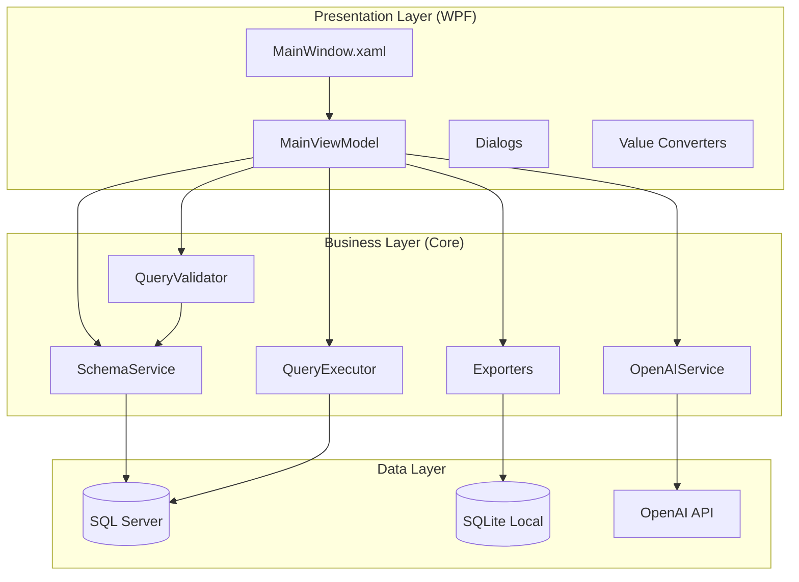

---

## Component Architecture

### Presentation Layer (VeritasSQL.WPF)

The UI layer follows the MVVM pattern using CommunityToolkit.Mvvm.

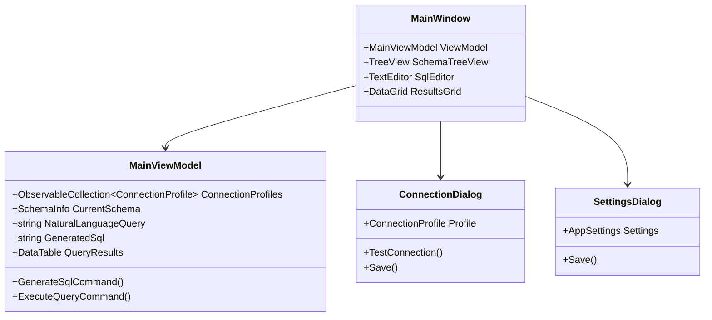

### Business Layer (VeritasSQL.Core)

Core business logic organized by responsibility.

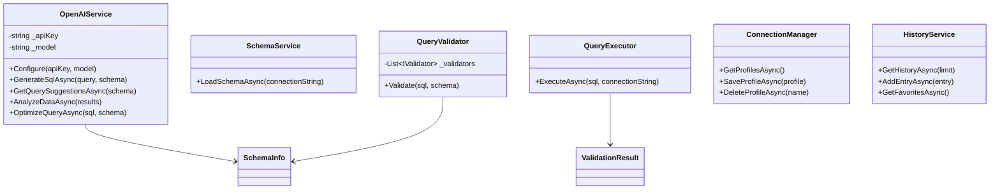

---

## Data Flow

### Query Execution Flow

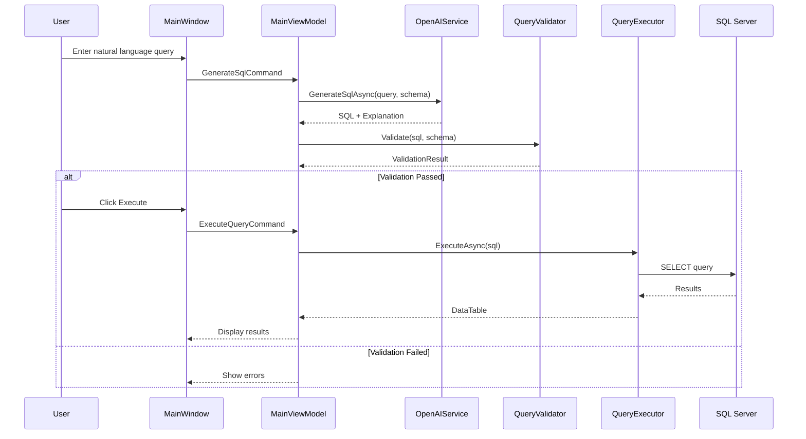

### Security Validation Pipeline

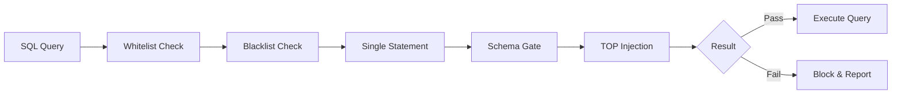

---

## Security Architecture

### Multi-Layer Validation

| Layer | Purpose | Implementation |
|-------|---------|----------------|
| 1. Whitelist | Only SELECT allowed | Regex pattern matching |
| 2. Blacklist | Block dangerous keywords | Keyword list check |
| 3. Single Statement | Prevent injection | Semicolon detection |
| 4. Schema Gate | Only known objects | Schema metadata validation |
| 5. TOP Injection | Limit result size | Automatic TOP clause |
| 6. Performance | Warn on risky patterns | Heuristic analysis |

### Data Protection

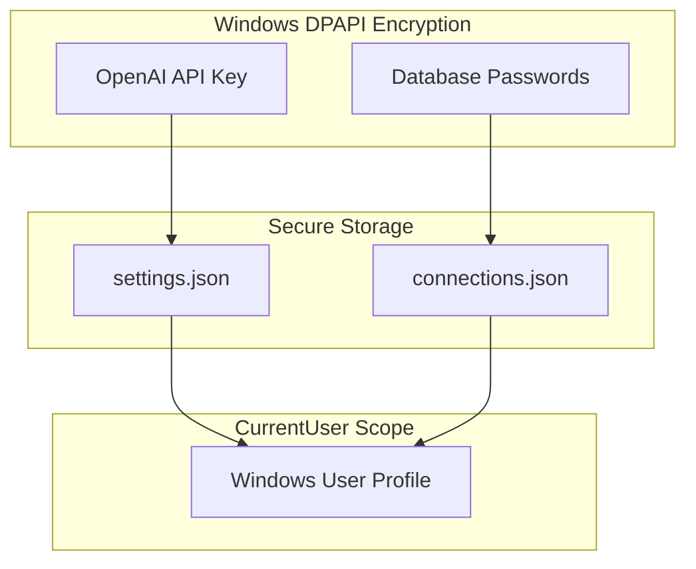

### Audit Trail

Every action is logged to SQLite with:

- Timestamp (UTC)
- User identity
- Action type (Connect, GenerateSQL, Execute, Export)
- Data source
- Natural language query
- Generated SQL
- Validation status
- Execution result
- Error details (if any)

---

## AI Integration Architecture

### OpenAI Service Methods

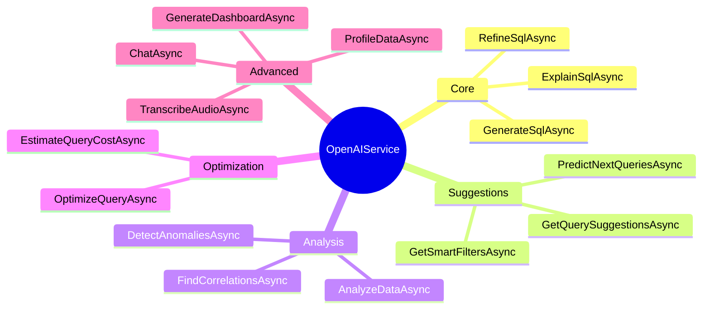

### AI Feature Categories

| Category | Features | Purpose |
|----------|----------|---------|
| **Core NL-to-SQL** | Generate, Explain, Refine | Basic translation |
| **Suggestions** | Query, Filter, Predictive | Proactive assistance |
| **Analysis** | Insights, Anomalies, Correlations | Data understanding |
| **Optimization** | Performance, Cost | Query improvement |
| **Advanced** | Chat, Dashboard, Profiling | Enterprise features |

---

## Dependency Injection

### Service Registration (App.xaml.cs)

```csharp
private void ConfigureServices(IServiceCollection services)
{
    // Core Services (Singleton - shared state)
    services.AddSingleton<ConnectionManager>();
    services.AddSingleton<SettingsService>();
    services.AddSingleton<SchemaService>();
    services.AddSingleton<QueryExecutor>();
    services.AddSingleton<HistoryService>();
    services.AddSingleton<AuditLogger>();
    services.AddSingleton<DomainDictionaryService>();
    services.AddSingleton<OpenAIService>();

    // Export Services (Transient - stateless)
    services.AddTransient<CsvExporter>();
    services.AddTransient<ExcelExporter>();

    // ViewModels (Singleton - UI state)
    services.AddSingleton<MainViewModel>();

    // Windows (Transient - new instance each time)
    services.AddTransient<MainWindow>();
}
```

### Service Lifetime Strategy

| Lifetime | Services | Reason |
|----------|----------|--------|
| Singleton | ConnectionManager, SettingsService, OpenAIService | Shared configuration state |
| Singleton | HistoryService, AuditLogger | Single database connection |
| Singleton | MainViewModel | UI state preservation |
| Transient | Exporters | Stateless operations |
| Transient | Dialogs | Fresh instance per use |

---

## Data Models

### Core Models

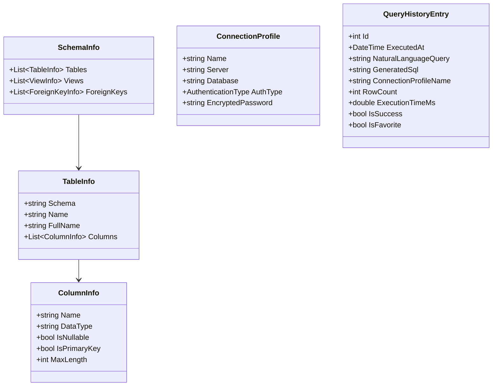

### AI Response Models

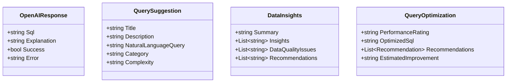

---

## Storage Architecture

### Local Storage (SQLite)

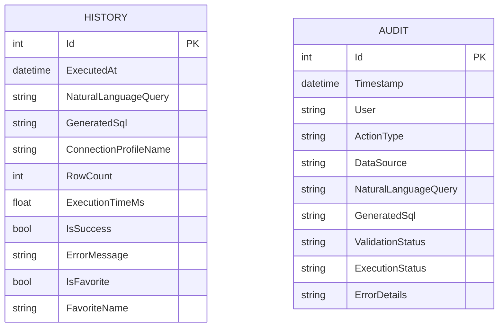

### File Storage

```
%AppData%\VeritasSQL\
├── connections.json      # Encrypted connection profiles
├── settings.json         # App settings (encrypted API key)
├── domain_dictionary.json # Custom term mappings
├── history.db            # SQLite query history
└── audit.db              # SQLite audit log
```

---

## Performance Considerations

### Async Operations

All I/O operations are asynchronous to keep the UI responsive:

- Database queries
- OpenAI API calls
- File operations
- Schema loading

### Caching Strategy

| Data | Cache Location | Invalidation |
|------|----------------|--------------|
| Schema | Memory (SchemaInfo) | Manual reload |
| Connection profiles | Memory + File | On save |
| Settings | Memory + File | On save |
| History | SQLite | Never (append-only) |

### Query Optimization

- Automatic TOP clause injection
- Configurable timeout (default: 30s)
- Row limit enforcement (default: 100, max: 10,000)

---

## Extensibility Points

### Adding New AI Features

1. Add model class in `Models/`
2. Add method in `OpenAIService`
3. Add property/command in `MainViewModel`
4. Add UI in `MainWindow.xaml`

### Adding New Export Formats

1. Create exporter class in `Export/`
2. Register in DI container
3. Add command in ViewModel

### Adding New Validation Rules

1. Implement `IQueryValidator` interface
2. Add to validation pipeline
3. Define severity level

### Adding Database Support

1. Create provider-specific `SchemaService`
2. Create provider-specific `QueryExecutor`
3. Update connection dialog

---

## Technology Decisions

### Why WPF?

- Rich desktop UI capabilities
- Native Windows integration (DPAPI)
- Mature ecosystem
- MVVM support

### Why .NET 8?

- Latest LTS version
- Performance improvements
- Modern C# features
- Cross-platform potential (future)

### Why SQLite for Local Storage?

- Zero configuration
- Single file database
- ACID compliance
- Excellent performance

### Why OpenAI GPT-4?

- Best-in-class natural language understanding
- Reliable SQL generation
- Context awareness
- Continuous improvements

---

## Future Architecture Considerations

### Planned Enhancements

- **PostgreSQL/MySQL Support**: Abstract database provider
- **Plugin System**: Dynamic feature loading
- **Cloud Sync**: Optional settings synchronization
- **Multi-Language UI**: Resource-based localization

### Scalability Path

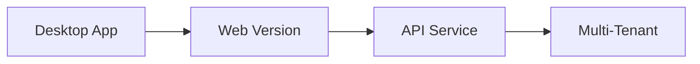
